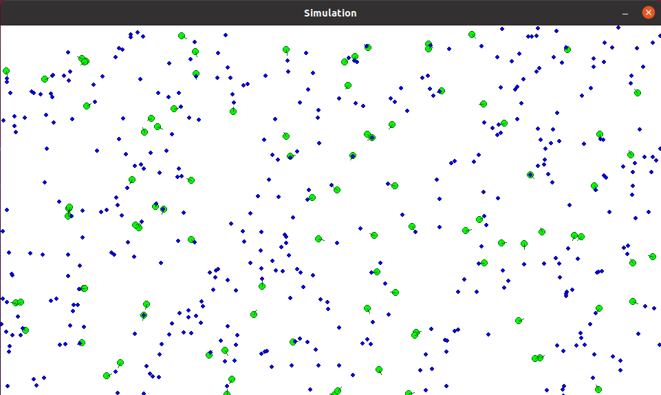
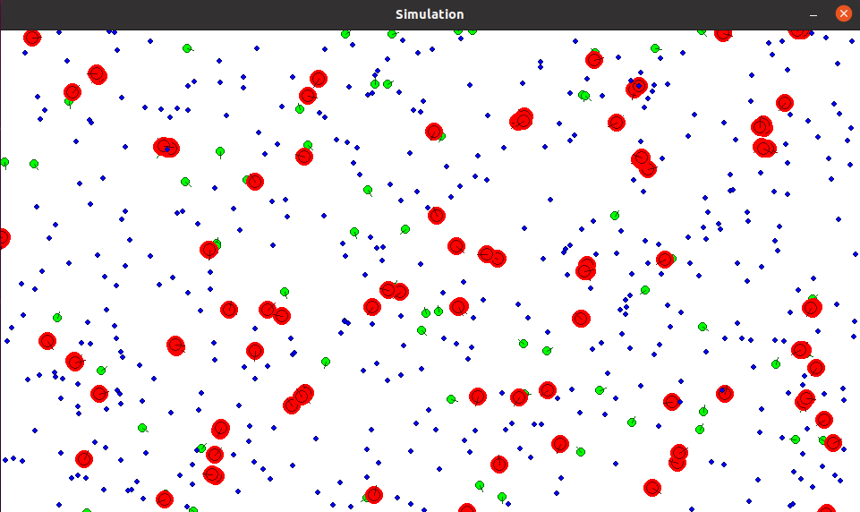
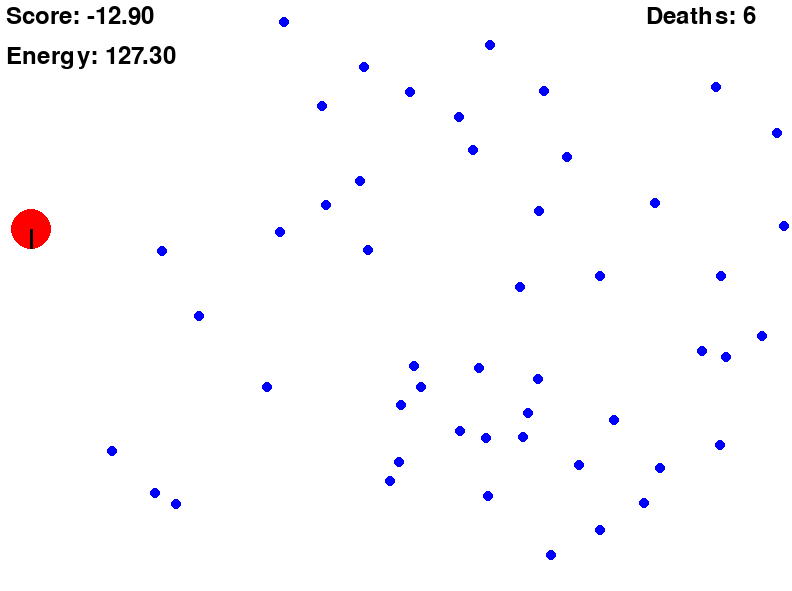

# evolving-simple-organisms

start sminulation:

`cd ~/evolving-simple-organisms/learning_direction`

`python main.py`

new terminal:

`tensorboard --logdir=logs`

for simulation photo:

update version:

Creating weights for an organism:

